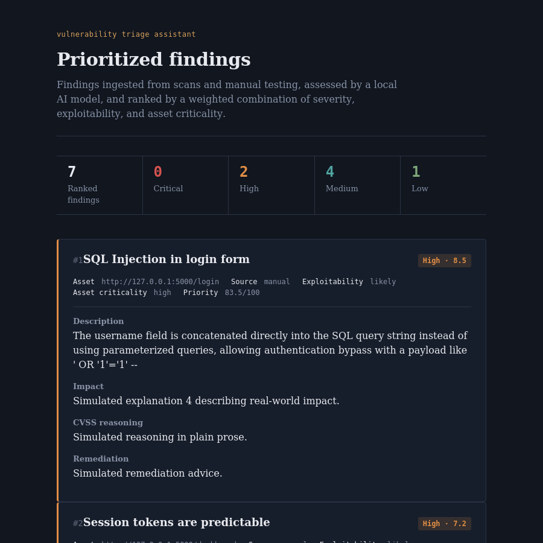

# AI-Powered Vulnerability Triage Assistant


A tool that takes raw, messy security findings from multiple sources
(Nmap scans, manual pentest notes, exploit scripts) and uses a local
AI model to explain, score, and prioritize them the way a senior
security analyst would — instead of leaving you with a flat list of
"high/medium/low" tags and no context.



Ties directly into other projects in this portfolio: findings from a
VulnBank-style exploit exercise can be fed straight into this tool as
manual JSON input.

## What this is NOT

This tool does not scan for or discover vulnerabilities itself. It
sits **downstream** of scanning and manual testing (Nmap, Burp, your
own exploit scripts). Its job is to take findings that have already
been discovered and turn them into a structured, explained, and
prioritized report — the analysis and reporting work a human analyst
would otherwise do by hand.

## What's built

- **Data model** (`models.py`) — SQLite schema carrying each finding
  from raw ingestion through AI triage through final prioritization.
- **Parsers** (`parsers/`) — Nmap XML and manual/VulnBank-style JSON
  ingestion.
- **AI triage engine** (`engine/triage_engine.py`) — sends each finding
  to a local LLM (via [Ollama](https://ollama.com)) with a carefully
  designed system prompt that forces structured JSON output: plain-
  English explanation, a CVSS score **with reasoning**, an
  exploitability assessment, and concrete remediation advice.
- **Prioritization engine** (`scoring/prioritizer.py`) — a custom
  weighted-scoring algorithm (CVSS 50% + exploitability 30% + asset
  criticality 20%) that ranks findings by actual risk, not just raw
  severity.
- **HTML report generator** (`reports/report_generator.py`) — produces
  a clean, shareable static HTML report.
- **Web dashboard** (`web/`) — a Flask app for browsing ranked findings
  in the browser with a distinct, security-briefing-style visual
  design (not a generic SaaS template).
- **CLI** (`cli.py`) — ties the whole ingest → triage → prioritize →
  report pipeline together.

Runs **100% locally and free** — no API key, no billing, no internet
required once the Ollama model is downloaded.

## Requirements

- Python 3.9+
- [Ollama](https://ollama.com/download) installed and running locally
- A pulled model — `llama3.2:3b` recommended for normal laptops without
  a dedicated GPU

## Setup

```bash
# 1. Install Ollama (one-time): https://ollama.com/download
ollama pull llama3.2:3b
# Ollama usually starts automatically after install.
# If not: ollama serve

# 2. Install Python dependencies
pip install -r requirements.txt
```

## Usage — full pipeline

```bash
python cli.py init
python cli.py ingest-nmap sample_data/sample_nmap.xml
python cli.py ingest-manual sample_data/sample_findings.json
python cli.py triage           # AI triage via local Ollama model
python cli.py prioritize       # custom risk-based ranking
python cli.py rank             # view ranked list in terminal
python cli.py report           # generate reports/triage_report.html
python cli.py show <id>        # full detail on one finding
python cli.py reset            # clear the database
```

### Using a different model

```bash
# Command Prompt
set TRIAGE_MODEL=llama3.1:8b
# PowerShell
$env:TRIAGE_MODEL="llama3.1:8b"
# macOS/Linux
export TRIAGE_MODEL="llama3.1:8b"
```

## Usage — web dashboard

After running `triage` and `prioritize` at least once:

```bash
cd web
python app.py
```

Then open **http://127.0.0.1:5050** in your browser. The dashboard is
read-only — it displays whatever is already in `triage.db`; run the
CLI pipeline first to populate it.

## Project structure

```
vuln-triage-assistant/
  models.py
  cli.py
  parsers/
    nmap_parser.py
    manual_parser.py
  engine/
    triage_engine.py
  scoring/
    prioritizer.py
  reports/
    report_generator.py
  web/
    app.py
    templates/
      base.html
      dashboard.html
  sample_data/
    sample_nmap.xml
    sample_findings.json
  docs/
    dashboard_screenshot.png
  requirements.txt
  LICENSE
  .gitignore
```

## Roadmap

- [x] **Step 1** — Data model + ingestion parsers + CLI
- [x] **Step 2** — AI triage engine (local, via Ollama)
- [x] **Step 3** — Custom risk-based prioritization scoring
- [x] **Step 4** — HTML report generator + Flask web dashboard
- [ ] **Stretch** — optional hosted demo with pre-loaded sample data
      (no live AI calls from public visitors — see design notes above)
